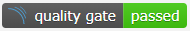
# SennedjemFw
Sennedjem CQRS (Command Query Responsibility Segregation) yaklaşımını benimseyen ve SOLID prensiplerini ve Clean Architecture yöntemlerini odaklayan bir yazılım geliştirme alt yapısıdır.

UtilityFiles Klasörü altında kod üretecine, Visual Studio 2019 Template dosyasına ulaşabilirsiniz. 

Kod üretecinin geliştirilmesinde örnek olarak Halil İbrahim Duymaz'ın https://github.com/irpg7/NLayeredCommandMenu bu deposundan faydalanılmıştır.
Sennedjemgen.vsix dosyası Sennedjem Framework için tüm katmanların kod üretecidir. VS2019 için extension olarak hazırlanmıştır. Örnek kullanım videosuna youtube linki üzerinden erişim sağlayabilirsiniz. https://youtu.be/BAuzZNMaaJA

Her türlü desteğini gece gündüz esirgemeden veren https://github.com/irpg7 **Halil İbrahim Duymaz** kardeşime,

Fikir ve desteğini hiç esirgemeyip motivasyonumu kaybettiğim anda bile beni ayakta tutan https://github.com/kurtbogan88 **Murat Kurtboğan** kardeşime,

Geliştirmede öncülük ettiği için https://github.com/Engindemirog **Engin Demiroğ** Hocamıza çok özel teşekkürler..

SennedjemFw Nasıl Kullanılır.
=============================
**Yeni Güncelleme**

SennedjemFw artık Vs2019 template projesi olarak kullanabilirsiniz. UtilityFiles için bulunan **SennedjemFw.zip** dosyasını  aşağıdaki gösterildiği şekilde kopyalayın

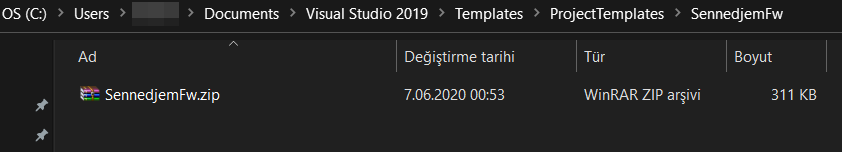

Vs2019 Create a New Project ekranında sennedjemFw aratın karşınıza proje template olarak gelecektir.
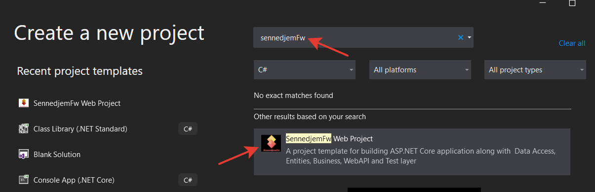

**SennedjemFw** nasıl
kullanılacağıyla ilgili bir örnek yapıya dokumanı takip ederek ulaşabilirsiniz.

Öncelikle **SennedjemGen** isimli Visual Studio Extension
kurulur. (Artık Marketplace üzerinden de ulaşılabilir halde)
https://marketplace.visualstudio.com/items?itemName=SennedjemFwGen.SennedjemFwGen

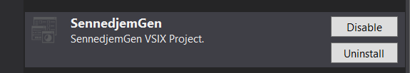

Bir **Entity** sınıfı oluşturulur ve **IEntity** **Interface**
kullanılarak **implemente** edilir. Örnek olarak basit bir Car Sınıfı
oluşturulmuştur.

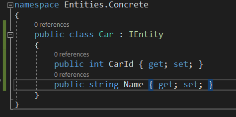

**Solution Explorer** üzerinden ilgili sınıfa sağ tıklanır ve **Sennedjem Menu**
altından **Sennedjem Generate All Layers For Entity** yardımıyla sınıfa ait tüm
proje ağacı oluşturulur gerekli klasörleriyle birlikte oluşturulur.

Eğer yeni bir Query veya Command sınıfına ihtiyaç duyulursa **Sennedjem Menu** aracılığı ile template sınıflar yaratılabilir.

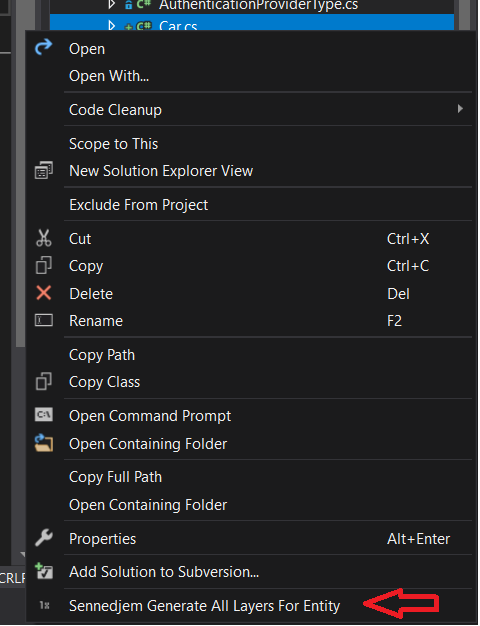

Aşağıdaki gibi bir splash screen devreye girer bununla birlikte tüm
katmanlarda gerekli olan sınıflar ve kodlar yaratılır.

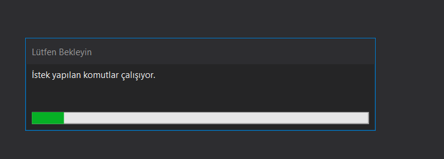

Bununla birlikte örnek sınıf için yaratılan sınıfların ekran görüntüsü
aşağıda belirtilmiştir.

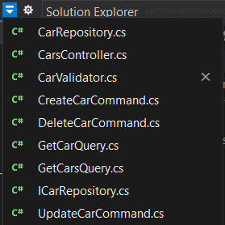

Şablon Sınıflar otomatik olarak yaratıldıktan sonra şu an için manuel
olarak yapılması gereken işlemler aşağıdaki gibi tanımlanacaktır.

DataAccess Katmanı
==================

**DataAccess-\>Concrete-\>EntityFramework-\>Contexts-\>ProjectDbContext**
içine **DbSet** Tanımlama işleminin yapılması gerekir.

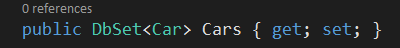

Buna ek olarak özel bir mapping yapılacaksa
**DataAccess-\>Concrete-\>Configurations** klasörü altında yapılabilir
özel bir durum yoksa yapılmasına gerek yoktur.

Migrations için kullanacağınız veritabanına göre aşağıdaki komutları
çalıştırarak migrationlarınızı yapabilirsiniz. Burada dikkat etmeniz gereken Migration yaparken Mode seçmeniz gerekliliğidir.
Örneğin Staging ve Production. Default olarak Staging seçilmesi önerilir. Development Modu zaten InMemory çalıştığı için özel bir migrationa ihtiyaç yoktur.

**// PostgreSQL**

$env:ASPNETCORE_ENVIRONMENT='Staging'

Add-Migration InitialCreate -Context ProjectDbContext -OutputDir Migrations/Pg

$env:ASPNETCORE_ENVIRONMENT='Staging'

Update-Database -context ProjectDbContext

**// Ms Sql Server**

$env:ASPNETCORE_ENVIRONMENT='Staging'

Add-Migration InitialCreate -context MsDbContext -OutputDir Migrations/Ms

$env:ASPNETCORE_ENVIRONMENT='Staging'

Update-Database -context MsDbContext

Migration işlemlerini yaparken **Default Project** kısmında
**DataAccess** seçili olduğuna ve migrationun ismini
**değiştirdiğinize** emin olun. **İlk defa migration yapıyorsanız**
değişiklik yapmanıza **gerek yoktur**.

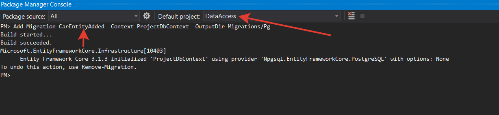

Bu işlemden sonra aşağıdaki komutu çalıştırmayı lütfen unutmayın.

**Update-Database -context ProjectDbContext**

Business Katmanı
================

İş kodlarının yazılacağı yerdir.

**Business-\>Startup.cs** sınıfına
**Autofac** için gerekli olan **Register** işlemi burada konfigüre
edilir. Burası aynı zamanda Development, Staging, Production ortamlarının yönetildiği yerdir.

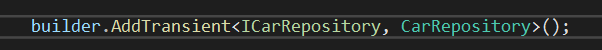

Bu sınıf aynı zaman da sistemin hangi veritabanı altyapısıyla
çalışacağının da belirtildiği yerdir. **SennedjemFw** default olarak 3
veri tabanına ayrı ayrı veya **multipleDb** şeklinde destek verebilir.
**PostgreSql**, **MsSql** ve **InMemoryDb**

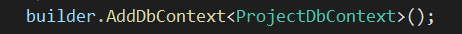

Şekilde ki gibi bırakılırsa **PostgreSql** default veritabanı ile
çalışır. Bu konfigürasyonu ise WebAPI katmanında **appsettings** dosyası
içinden okur.

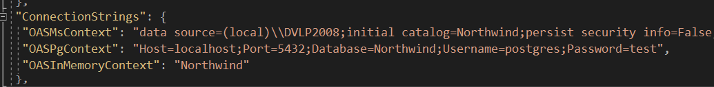

MsSql için aşağıdaki şekilde ve

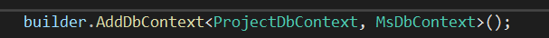

InMemory için aşağıdaki şekilde konfigüre edilir.

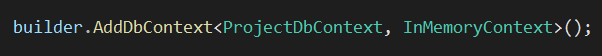

Bu aşamaları takiben **Solution Explorer** altında
**Business-\>Handlers-\>Cars-\>Commands** klasörüne gelinir.

Önce Request'ten yani angular, react, aspnet mvc, mobil, vb ön yüz
uygulamalarından gelmesi beklenen alanlar burada tanımlanır. Test
amacıyla api katmanında **Swagger** tanımlıdır.

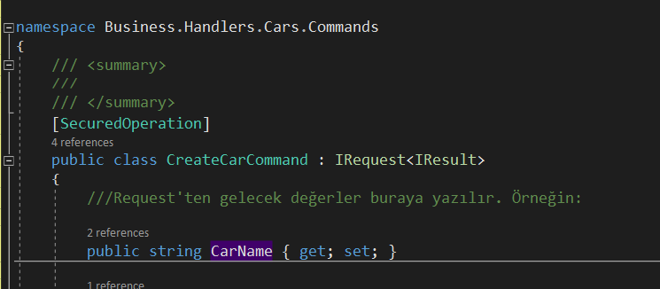

Daha sonra aynı sınıf içindeki **Handle** Metodunun içi sınıfındaki
özelliklerine göre gerekli tanımlamalar yapılır.

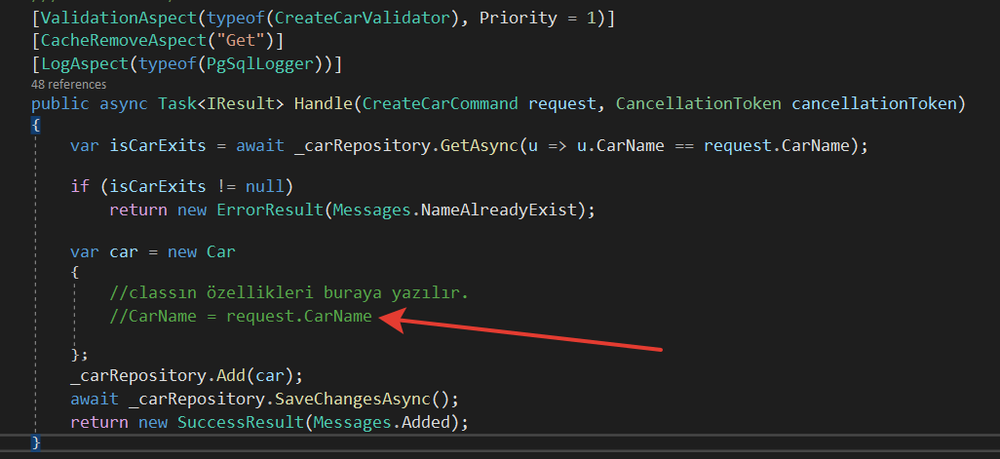

**Business-\>Handlers-\>Cars** klasörü altında **Commands** ve **Query**
klasörlerinde bulunan tüm sınıflar için yukarıda bahsedilen kontrollerin
yapılması tavsiye edilir. Sennedjem Gen kod üreteci sürekli olarak
geliştirilmeye devam etmektedir. Tüm propertyleri de tanıyacak hale
getirilmesi için uğraşılmaktadır. Yukarıda bahsedilen işlerin
yapılmasına gerek kalmayacak hale getirilmesi planlanmaktadır.

WebAPI Katmanı
==============

Bu katman dış dünyayla haberleşmenin yapıldığı ilk giriş noktasıdır.
Handler'larda tanımlı olan tüm operasyonlar burada otomatik olarak
tanımlı gelir özellikle bir kontrol yapmaya gerek yoktur.
Controllerların içine yeni bir şey eklenmediği sürece özel bir
mekanizması bulunmamaktadır.

Swagger üzerinden api dökümantasyonunu zenginleştirmek isterseniz
Controllerlar üzerinde bulunan summaryleri düzgünce yazmanız apiyi
kullanacak olan geliştiriciler için faydalı olacaktır.

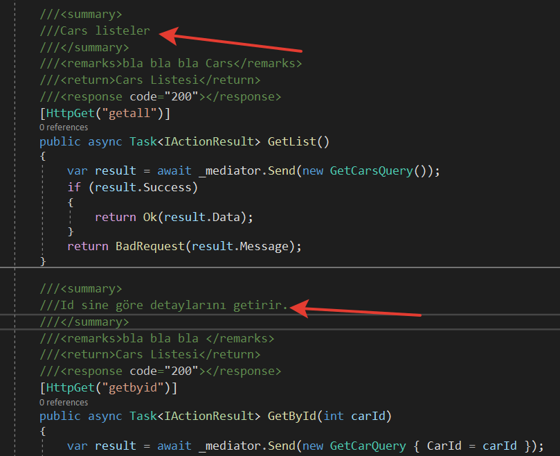

appsettings dosyası içinde tüm konfigürasyon yönetimi yapılır. Örneğin
RabbitMq,ElasticSearch,Mail, Veritabanı bağlantısı vb.

Sonuç olarak swagger üzerinde aşağıdaki ekran görüntüsünü almayı
beklemekteyiz.

